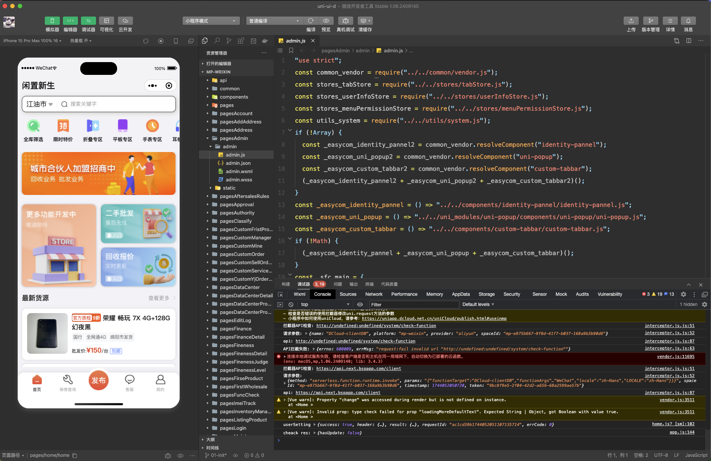

# 闲置新生 B端电商小程序 (uni-ui-d)


## 项目简介

uni-ui-d是一个基于uni-app框架开发的移动商城和产品管理应用，为用户提供全面的电子商务解决方案。该应用支持多平台运行，包括微信小程序、H5等，实现了从产品浏览、搜索、下单到支付的完整电商流程，同时集成了商品管理、订单管理、用户管理等功能模块。

## 功能特点

- **完整的电商流程**：浏览商品、加入购物车、下单支付、订单管理
- **多样化商品管理**：商品分类、详情展示、价格管理、库存管理
- **个性化用户中心**：用户登录注册、个人信息管理、收货地址管理
- **智能搜索系统**：支持商品模糊搜索、分类筛选、排序功能
- **订单全流程跟踪**：订单创建、支付、发货、收货、售后等全流程管理
- **数据分析中心**：销售数据统计、用户行为分析、商品热度分析
- **多角色权限管理**：支持商家、用户、管理员等不同角色权限设置
- **地理位置服务**：集成地图功能，支持位置选择和导航

## 技术栈

- **前端框架**：uni-app (Vue3)
- **状态管理**：Pinia
- **UI组件**：uv-ui-tools、自定义组件
- **地图服务**：微信地图API
- **搜索引擎**：Fuse.js、FlexSearch
- **数据加密**：crypto-js
- **路由管理**：uni-simple-router

## 项目结构

```
├── api/                # API请求模块
│   ├── address/        # 地址相关API
│   ├── login/          # 登录认证API
│   ├── member/         # 用户信息API
│   ├── product/        # 产品相关API
│   └── shopCard/       # 购物车API
├── components/         # 通用组件
│   ├── custom-header/       # 自定义页面头部
│   ├── custom-tabbar/       # 底部导航栏
│   ├── custom-shop-tabbar/  # 商城底部导航栏
│   └── custom-product-card/ # 产品卡片组件
├── pages/              # 主要页面
│   ├── home/           # 首页
│   ├── index/          # 索引页
│   ├── market/         # 市场页
│   ├── message/        # 消息页
│   └── mine/           # 我的页面
├── pages*/             # 业务功能页面
│   ├── pagesLogin/     # 登录页面
│   ├── pagesProduct/   # 产品页面
│   ├── pagesOrder/     # 订单页面
│   └── pagesShopCar/   # 购物车页面
├── stores/             # Pinia状态管理
│   ├── tokenStore.js   # 用户token管理
│   ├── userInfoStore.js# 用户信息管理
│   └── locationStore.js# 位置信息管理
├── utils/              # 工具函数
│   ├── apiRequest.js   # API请求工具
│   ├── common.js       # 通用工具函数
│   ├── interceptor.js  # 路由拦截器
│   └── wxMapAPI.js     # 微信地图API工具
├── static/             # 静态资源
├── App.vue             # 应用入口组件
├── main.js             # 应用入口文件
├── manifest.json       # 应用配置文件
├── pages.json          # 页面路由配置
└── uni.scss            # 全局样式变量
```

## 开发环境要求

- Node.js 14.0+
- HBuilderX 3.6.0+
- 微信开发者工具（用于小程序预览和调试）
- npm 或 yarn 包管理工具

## 安装与运行

1. **克隆项目**

```bash
git clone [项目仓库地址]
cd uni-ui-d
```

2. **安装依赖**

```bash
npm install
# 或
yarn install
```

3. **运行项目**

- 使用HBuilderX打开项目
- 点击"运行">"运行到浏览器"或"运行到小程序模拟器"
- 或通过命令行：

```bash
# 运行到H5
npm run dev:h5
# 运行到微信小程序
npm run dev:mp-weixin
```

## 配置说明

主要配置文件：

- **manifest.json**: 应用基本配置，包括应用名称、appid、版本号等
- **pages.json**: 页面路由配置，定义页面路径、窗口样式、tabbar等
- **main.js**: 应用入口文件，配置全局组件、混入等

## 开发指南

### 组件开发

遵循Vue单文件组件（SFC）格式:

```vue
<template>
  <!-- 模板内容 -->
</template>

<script>
// 导入语句
import Component from '@/components/Component';
import { useStore } from '@/stores/store';

export default {
  // 选项按以下顺序排列
  components: {},
  props: {},
  data() {
    return {};
  },
  computed: {},
  watch: {},
  created() {},
  mounted() {},
  methods: {}
};
</script>

<style lang="scss">
/* 样式内容 */
</style>
```

### API使用

API请求模块位于`/api`目录，按功能模块组织:

```javascript
// 导入请求工具
import request from '@/utils/request';

// 定义API
export const getProductList = (data) => request({
  url: '/api/product/list',
  method: 'GET',
  data
});

// 使用API
import { getProductList } from '@/api/product/product';

// 在组件中调用
const result = await getProductList({ page: 1, size: 10 });
```

### 状态管理

使用Pinia进行状态管理:

```javascript
// 定义store
// stores/userInfoStore.js
import { defineStore } from 'pinia';

export const useUserStore = defineStore('user', {
  state: () => ({
    userInfo: {},
    shopCarCount: 0
  }),
  actions: {
    async updateUserInfo(info) {
      this.userInfo = info;
    },
    async refreshShopCarCount() {
      // 刷新购物车数量的逻辑
    }
  }
});

// 使用store
import { useUserStore } from '@/stores/userInfoStore';

// 在组件中
const userStore = useUserStore();
userStore.updateUserInfo(newInfo);
```

## 部署说明

### 微信小程序部署

1. 在HBuilderX中选择"发行">"小程序-微信"
2. 生成小程序代码
3. 使用微信开发者工具上传代码
4. 在微信小程序后台提交审核发布

### H5部署

1. 在HBuilderX中选择"发行">"网站-H5手机版"
2. 将生成的dist文件夹部署到Web服务器
3. 配置服务器（nginx/apache等）指向该目录


## 版权和许可
内部使用，禁止分发
版权所有 © 2025 [闲置新生] 保留所有权利。

本软件为专有软件，未经授权不得复制、修改、分发或用于任何商业用途。
使用本软件即表示您接受我们的使用条款和条件。
